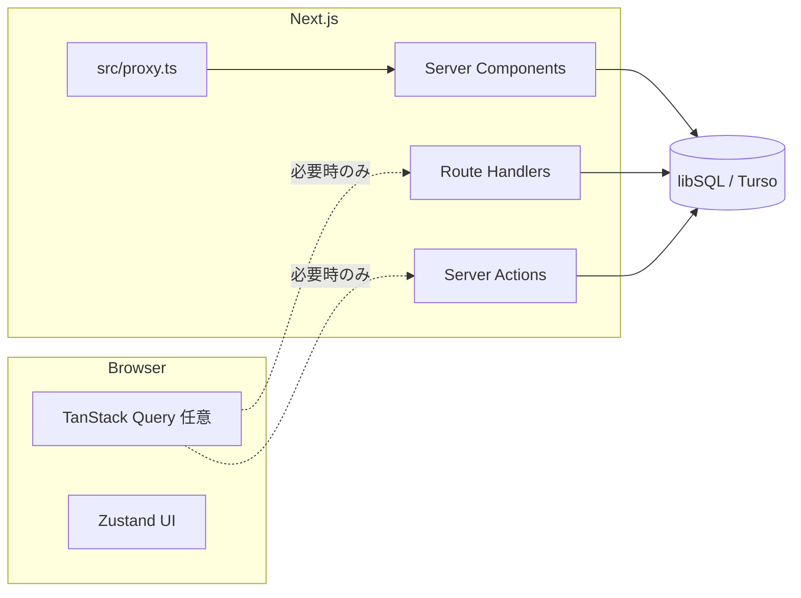

# Threadhall 設計メモ（設計段階）

実装の詳細は意図的に書かない。合意したい論点・フォルダ責務・データの置き方・`src/proxy.ts` の役割までを固定する。

**製品・インフラの確定事項・権限・画面対応**は [`system/README.md`](system/README.md) 配下へ分離した。

**永続層とクライアント取得の契約**（ORM なし・マイグレ追跡・TanStack と RSC の分担）は [`data/CONTRACTS.md`](data/CONTRACTS.md)。

## 1. プロダクトの前提（README との接続）

- **長命スレッド**: コミュニティ内で育つ、締切のない（または稀にのみ区切る）会話・記録の軸。
- **イベントログ**: 会場・締切・開催期間などで**自然に閉じる**ログ。スレッドとはライフサイクルと UX が異なる。

両者を同一アプリで扱うが、**ドメインモデルとルーティングは分離**する（後述）。

## 2. 技術スタック（現リポジトリの事実）

| 層 | 採用 | 備考 |
|----|------|------|
| フレームワーク | Next.js 16（App Router） | RSC 優先。クライアントは必要箇所のみ |
| DB | Turso / libSQL（`@libsql/client`） | ローカルは Docker `sqld`。接続は `src/lib/db.ts`。**ORM なし** |
| スキーマ管理 | `db/migrations/*.sql` + `npm run db:migrate` | 変更は常に新規番号ファイル。[`docs/data/CONTRACTS.md`](data/CONTRACTS.md) |
| 入力検証 | Zod（`src/schemas/*`） | **HTTP / Server Action 境界**に限定。行型は `src/types/db/*` |
| クライアント取得・再試行 | 必要時のみ TanStack Query | **RSC で足りる画面では導入しない**（現状は依存なし。重複キャッシュを避ける） |
| UI ローカル状態 | Zustand | サイドバー開閉など純 UI のみ |
| スタイル | Tailwind CSS 4 | `globals.css` でトークン拡張予定 |

## 3. 論理アーキテクチャ（データの流れ）



- **取得の第一選択**: Server Component で `src/server/queries/*` を呼び、props で渡す（Next の RSC ツリー内で完結。**クライアントに同じデータの Query キャッシュを二重で持たない**）。
- **TanStack Query を足す条件の例**: 同一データをブラウザから短周期で再取得したい、楽観更新したい、`router.refresh` だけでは UX が足りない——など。**導入時は `CONTRACTS.md` に理由を1行追記**する。
- **URL に載せたい状態**: `searchParams`（フィルタ・ソート・ページング）。

## 4. ドメイン分割（概念）

| 概念 | 説明 | ルート例（案） |
|------|------|----------------|
| Thread | スレッド本体・投稿の親 | `/threads`, `/threads/[threadId]` |
| Event | 期間・会場付きログ | `/events`, `/events/[eventId]` |
| Post / Entry | スレッド内投稿 vs イベント参加記録 | 同一 `posts` でもよいが **type またはテーブル分離** を設計で先に決める |

## 5. データモデル案（スキーマは未作成）

確定ではない。マイグレーション導入時のたたき台。

- **threads**: `id`, `slug`, `title`, `community_id?`, `created_at`, `updated_at`, `archived_at?`
- **events**: `id`, `slug`, `title`, `starts_at`, `ends_at`, `venue?`, `created_at`
- **posts**（または thread_posts / event_entries）: 親 FK、本文、`author_id?`, `created_at`
- **users**（認可を入れる場合）: 外部 IdP 連携時は `external_id` 等

認証を入れる場合は **Server Action / Route Handler でセッション検証**し、**`src/proxy.ts` では軽いガードのみ**（例: メンテナンスヘッダ）に留める方針を推奨（セッション取得の重さ・キャッシュとの関係）。

## 6. 最小コンポーネント階層（命名・置き場）

| 置き場 | 役割 |
|--------|------|
| `src/components/ui/` | ボタン、入力、ダイアログ等の汎用 UI（将来 shadcn 等と整合） |
| `src/components/layout/` | シェル、ヘッダ、サイドバー、フッタ |
| `src/components/domain/` | 「スレッド」「イベント」に意味のあるブロック（カード、一覧行など） |

ページ（`page.tsx`）は薄く保ち、**ドメインコンポーネントと server query の合成**に留める。

## 7. サーバー専用コードの置き場

| 置き場 | 役割 |
|--------|------|
| `src/lib/db.ts` | DB クライアント取得（既存） |
| `src/server/queries/` | 読み取り専用のクエリ関数（RSC / Handler から利用） |
| `src/server/actions/` | Server Actions（ミューテーション）。`'use server'` ファイル |

**クライアントから `@/server/*` を import しない**（バンドル境界の事故防止）。

## 8. 型・スキーマ

| 置き場 | 役割 |
|--------|------|
| `db/migrations/` | テーブル定義の SSOT |
| `src/types/db/` | `SELECT` 行型（マイグレーションファイル名をコメントで紐付け） |
| `src/schemas/` | Zod：**境界の入力**のみ。`z.infer` を API 型に使い、DB 行型と混同しない |
| `docs/data/` | 契約・マイグレ手順・スキーマ用 CHANGELOG（破壊的変更の追跡） |

## 9. API 名前空間（Route Handlers）

既存: `GET /api/health/db`

想定（実装は後続）:

- `/api/threads/*` … 一覧・詳細・投稿（REST または RPC 風 POST 1 本に集約するかは未決）
- `/api/events/*` … 同上
- 認可が必要な操作は **Server Action 寄り**に寄せる選択肢あり（cookie の扱いが単純）

## 10. プロキシ（`src/proxy.ts`）

Next.js 16 ではリクエストインターセプトの入り口を **`src/proxy.ts` の `export function proxy`** に置く。

**現在の責務**: 全リクエストのパススルー（土台のみ）。

**将来ここへ寄せるもの（候補）**:

- メンテナンスモードの直上返却
- セキュリティヘッダの付与（CSP は `next.config` との役割分担を決める）
- 認可が「パス単位で必ず弾きたい」場合の一部ルートガード（重い処理は避ける）
- Geo / 実験フラグによる rewrite の土台

**matcher**: 静的アセット・`/_next/*`・画像拡張子は除外済み。新しい例外を足すときはこのファイルと本節を更新する。

## 11. フォルダ構成（リポジトリ全体の目安）

```
threadhall/
├── db/
│   └── migrations/        # SQL SSOT（番号順適用）
├── docs/
│   ├── data/              # データ契約・CHANGELOG
│   └── DESIGN.md          # 本書
├── scripts/
│   └── migrate.ts         # npm run db:migrate
├── public/
├── src/
│   ├── app/               # App Router（レイアウト・ページ・api）
│   ├── components/
│   │   ├── ui/
│   │   ├── layout/
│   │   └── domain/
│   ├── hooks/             # クライアント用カスタムフック
│   ├── lib/               # フレームワーク非依存に近いユーティリティ・DB クライアント
│   ├── server/
│   │   ├── queries/
│   │   └── actions/
│   ├── stores/            # Zustand 等
│   ├── types/
│   ├── schemas/
│   └── proxy.ts           # Next.js 16 リクエストインターセプト
├── docker-compose.yml
└── ...
```

## 12. 環境変数（`.env.example` との関係）

- **現状**: `TURSO_DATABASE_URL`, `TURSO_AUTH_TOKEN`
- **後続で足しうるもの**（名前は実装時に確定）: 外部認証、解析、Rate limit、プレビュー用フラグ
- **UI 参照のみ（任意）**: Google Stitch の MCP をローカルから叩く用途で API キーを保持する場合、**リポジトリ・Issue・PR 本文にキーを書かない**。Cursor の MCP 設定や Secret 管理に限定する。
- **Cursor でのキー適用・起動**: `.env.local` だけでは MCP に自動反映されない。手順・確認項目は **[`develop/CURSOR_STITCH.md`](develop/CURSOR_STITCH.md)** にまとめる。

## 13. オープンな設計判断（実装前に決めたい）

1. 投稿を **単一 `posts` + discriminator** にするか、**テーブル分割**にするか。
2. スレッドとイベントの **URL とコミュニティ（ワークスペース）** の有無。
3. **リアルタイム**（Presence・通知）を Phase いつで入れるか（libSQL 単体のままか、別チャネルか）。

## 14. UI 参照ソース（Google Stitch）と実装ギャップ

高忠実度の見た目・コンポーネント分割の参照は **Google Stitch 上のプロジェクト** と一致させる。ここでは **MCP から再取得可能な事実**、**カラー定義の SSOT**、**現コードとの差** を Issue / 実装の共通言語として固定する。

### 14.1 Stitch プロジェクト（再現用メタ）

| 項目 | 値 |
|------|-----|
| 表示名 | Threadhall Geo-Temporal Threads |
| リソース名（MCP の `name`） | `projects/10966941952817124867` |
| 種別 | `TEXT_TO_UI_PRO` |
| 端末初期値 | `DESKTOP`（同一プロジェクト内にモバイル幅フレームあり） |
| テーマ | `LIGHT`、フォントは headline Geist / body Inter / label JetBrains Mono 系 |

用語対応（Stitch 画面文言 ↔ 本リポジトリのドメイン）:

- Stitch の「コミュニティ」≒ 実装・ドキュメント上の **組織（organization）**。
- 「長命スレッド」「イベントログ」は本書 §1・§4 の区分と対応させる。

### 14.2 GitHub Issue で活かす MCP 情報（秘密は載せない）

Stitch は **HTTP MCP**（`POST https://stitch.googleapis.com/mcp`）で JSON-RPC 風の呼び出しが可能。**API キーは Issue・PR・ログに貼らない**（再発行が必要になる）。

Issue に載せるとレビュー・実装が早い情報（MCP から取得可能）:

| 取得方法（概念） | Issue に貼る中身の例 |
|------------------|----------------------|
| `tools/call` → `get_project`（`name`: 14.1 のリソース名） | プロジェクト更新日時、`designTheme` の要約、サムネ `thumbnailScreenshot.downloadUrl` |
| 同上の JSON 内 `screenInstances[]` | 各画面の `sourceScreen`、`width` × `height`（キャンバス上のフレームサイズ） |
| `tools/call` → `get_screen`（`name`: `projects/.../screens/{screenId}`） | **画面タイトル**、`screenshot.downloadUrl`（スクリーンショット）、`htmlCode.downloadUrl`（HTML エクスポート）、`deviceType` |
| `designTheme` / `designMd` に含まれる YAML | 下表の **カラー・タイポ・spacing**（下記 14.4） |

ツール名の一覧（クライアント実装・スクリプト用）: `create_project`, `get_project`, `list_projects`, `list_screens`, `get_screen`, `generate_screen_from_text`, `edit_screens`, `generate_variants`, `upload_design_md`, `create_design_system`, `create_design_system_from_design_md`, `update_design_system`, `list_design_systems`, `apply_design_system`。

補足: `list_screens` は引数の組み合わせによってはエラーになることがある。**画面一覧は `get_project` の `screenInstances` + 各 `get_screen` が安定**。

### 14.3 Stitch 画面一覧と想定ルート・現状（2026-05 時点）

Stitch 側の画面タイトルと、本リポジトリで想定するルート案、および **現実装** の対応を並べる。

| Stitch 画面タイトル | 想定ルート（案） | 現状の実装 |
|----------------------|------------------|------------|
| ポータル・ダッシュボード | `/` または `/dashboard` | `/` は **開発用スキャフォールド**（DB・認証・組織試用）。Stitch のダッシュボード UI ではない |
| ポータル・ダッシュボード (Mobile) | 同上（レスポンシブ） | 同上 |
| コミュニティ/組織ページ | `/orgs/[slug]` など | **専用ページなし**。トップから API リンク・一覧のみ |
| コミュニティページ (Mobile) | 同上 | 同上 |
| スレッド詳細（長命スレッド） | `/threads/[threadId]` | **専用ページなし**。`POST /api/threads` と JSON のみ |
| スレッド詳細 (Mobile) | 同上 | 同上 |
| イベントログ（期間限定スレッド） | `/events/[eventId]` | **専用ページなし**。`POST /api/events` と JSON のみ |
| イベントログ (Mobile) | 同上 | 同上 |
| 共通コンポーネント・パーツ一覧 | （ドキュメント or Story 化） | 未整備 |
| DESIGN.md（キャンバス） | 本書・`docs/DESIGN.md` | アーキテクチャは本書。Stitch 側は**視覚的な DESIGN キャンバス**として別物 |
| デザインシステム Instance | トークン SSOT | 下記 14.4 をコードへ未反映 |

### 14.4 カラー・タイポ・スペーシング（Stitch の SSOT）

実装では `globals.css` の `@theme` や Tailwind 拡張へマップする。**値は Stitch の `designMd` / `namedColors` に合わせる**（ここでは主要なもののみ列挙）。

**カラー（意味ラベル → 用途の目安 → 例）**

| トークン名（Stitch） | 用途の目安 | Hex（例） |
|----------------------|------------|-----------|
| `surface` | 全体背景 | `#f9f9f9` |
| `on_surface` | 主テキスト | `#1b1b1b` |
| `primary` | 主ボタン・強調 | `#000000` |
| `secondary` / `secondary_container` | リンク・アクセント UI | `#4648d4` / `#6063ee` |
| `on_secondary` | secondary 上のテキスト | `#ffffff` |
| `outline` / `outline_variant` | 境界線 | `#7e7576` / `#cfc4c5` |
| `surface_container*` | 段差のあるパネル | `#eeeeee`〜`#f3f3f3` ほか |
| `thread-stable` | 長命スレッド系の安定色 | `#0f172a` |
| `event-active` | イベント進行中の強調 | `#f59e0b` |
| `text-dim` | 補助テキスト | `#64748b` |
| `border-low` | 低コントラスト境界 | `#e2e8f0` |
| `surface-muted` | 控えめ背景 | `#f8fafc` |
| `error` 系 | エラー | `#ba1a1a` ほか |

**タイポグラフィ（Stitch designMd）**

- `headline-xl`: Geist, 36px, weight 700, line-height 1.2（モバイル用 `headline-xl-mobile`: 28px）
- `headline-lg` / `headline-md`: Geist, 24px / 18px, weight 600
- `body-lg` / `body-md`: Inter, 16px / 14px
- `label-sm`: JetBrains Mono, 12px, weight 500, letter-spacing 0.02em

**スペーシング**

- `container-max`: 1200px、`gutter`: 1.5rem、`margin-page`: 2rem、`stack-sm`〜`stack-lg`: 0.5〜2rem  
- `rounded`: `sm` 0.125rem 〜 `full` 9999px（Stitch の `ROUND_FOUR` と併記して移行する）

### 14.5「デザイン」と「現機能」の差分（要約）

| 観点 | Stitch（UI） | 現リポジトリ（機能・UI） |
|------|----------------|---------------------------|
| カラーモード | **ライト**基調（surface `#f9f9f9`） | トップは **zinc ダーク** + emerald の暫定 UI。Stitch トークン未接続 |
| フォント | Geist / Inter / JetBrains Mono | `layout` で Geist 想定だが `globals.css` の `body` は Arial 指定が残存しうる |
| 画面数 | ダッシュボード・組織・スレッド詳細・イベントログ・部品一覧 等 | **ルートは `/` のみ**。スレッド/イベントは **API + トップの mono 一覧** |
| データ | 見た目のみ | organizations / threads / events は **API と DB 層あり**（[`data/CONTRACTS.md`](data/CONTRACTS.md)）。UI 未接続 |
| 地理・時期制限 | デザイン上のコンセプト | `src/proxy.ts` はパススルー。**ルール未実装** |

### 14.6 改善候補（指示・Issue 用チェックリスト）

実装・デザインを揃える段階で、優先度はプロダクト指示に従う。

1. **トークン統合**: 14.4 を `globals.css` / Tailwind にマップし、暫定の `zinc`+`emerald` を置き換えるか、意図的に「ダークテーマ別ブランチ」とするかを決める。
2. **ルートとナビ**: 14.3 の想定ルートに沿って `app/` 配下へページを切る（RSC + `src/server/queries`）。
3. **用語・IA**: 「コミュニティ」表示を使うか、実装に合わせ「組織」のみにするかを画面単位で固定。
4. **Issue 添付**: 各 Issue に **Stitch の画面タイトル + `get_screen` の `screenshot.downloadUrl`（または時刻付きで保存した画像）** を貼り、仕様の単一参照にする。
5. **`list_screens` 不整合時**: `get_project` + `get_screen` にフォールバックする旨をスクリプト・ドキュメントに明記済みとする。

---

更新時は Pull Request の説明に「どの節を変えたか」を一文で書くと追跡しやすい。
