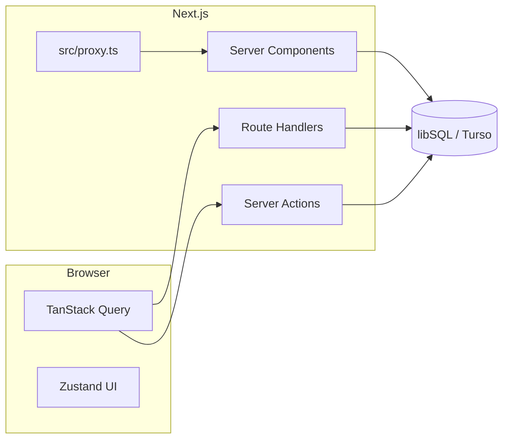

# Threadhall 設計メモ（設計段階）

実装の詳細は意図的に書かない。合意したい論点・フォルダ責務・データの置き方・`src/proxy.ts` の役割までを固定する。

**製品・インフラの確定事項・権限・画面対応**は [`system/README.md`](system/README.md) 配下へ分離した。

## 1. プロダクトの前提（README との接続）

- **長命スレッド**: コミュニティ内で育つ、締切のない（または稀にのみ区切る）会話・記録の軸。
- **イベントログ**: 会場・締切・開催期間などで**自然に閉じる**ログ。スレッドとはライフサイクルと UX が異なる。

両者を同一アプリで扱うが、**ドメインモデルとルーティングは分離**する（後述）。

## 2. 技術スタック（現リポジトリの事実）

| 層 | 採用 | 備考 |
|----|------|------|
| フレームワーク | Next.js 16（App Router） | RSC 優先。クライアントは必要箇所のみ |
| DB | Turso / libSQL（`@libsql/client`） | ローカルは Docker `sqld`。接続は `src/lib/db.ts` |
| サーバー状態（クライアント） | TanStack Query | ミューテーション・キャッシュの窓 |
| UI ローカル状態 | Zustand | サイドバー開閉など純 UI のみ |
| スタイル | Tailwind CSS 4 | `globals.css` でトークン拡張予定 |

## 3. 論理アーキテクチャ（データの流れ）



- **取得の第一選択**: Server Component で `src/server/queries/*` を呼び、props で渡す。
- **再利用・楽観更新・ポーリング**: Route Handler または Server Action を TanStack Query から呼ぶ。
- **URL に載せたい状態**: `searchParams`（フィルタ・ソート・ページング）。

## 4. ドメイン分割（概念）

| 概念 | 説明 | ルート例（案） |
|------|------|----------------|
| Thread | スレッド本体・投稿の親 | `/threads`, `/threads/[threadId]` |
| Event | 期間・会場付きログ | `/events`, `/events/[eventId]` |
| Post / Entry | スレッド内投稿 vs イベント参加記録 | 同一 `posts` でもよいが **type またはテーブル分離** を設計で先に決める |

## 5. データモデル案（スキーマは未作成）

確定ではない。マイグレーション導入時のたたき台。

- **threads**: `id`, `slug`, `title`, `community_id?`, `created_at`, `updated_at`, `archived_at?`
- **events**: `id`, `slug`, `title`, `starts_at`, `ends_at`, `venue?`, `created_at`
- **posts**（または thread_posts / event_entries）: 親 FK、本文、`author_id?`, `created_at`
- **users**（認可を入れる場合）: 外部 IdP 連携時は `external_id` 等

認証を入れる場合は **Server Action / Route Handler でセッション検証**し、**`src/proxy.ts` では軽いガードのみ**（例: メンテナンスヘッダ）に留める方針を推奨（セッション取得の重さ・キャッシュとの関係）。

## 6. 最小コンポーネント階層（命名・置き場）

| 置き場 | 役割 |
|--------|------|
| `src/components/ui/` | ボタン、入力、ダイアログ等の汎用 UI（将来 shadcn 等と整合） |
| `src/components/layout/` | シェル、ヘッダ、サイドバー、フッタ |
| `src/components/domain/` | 「スレッド」「イベント」に意味のあるブロック（カード、一覧行など） |

ページ（`page.tsx`）は薄く保ち、**ドメインコンポーネントと server query の合成**に留める。

## 7. サーバー専用コードの置き場

| 置き場 | 役割 |
|--------|------|
| `src/lib/db.ts` | DB クライアント取得（既存） |
| `src/server/queries/` | 読み取り専用のクエリ関数（RSC / Handler から利用） |
| `src/server/actions/` | Server Actions（ミューテーション）。`'use server'` ファイル |

**クライアントから `@/server/*` を import しない**（バンドル境界の事故防止）。

## 8. 型・スキーマ

| 置き場 | 役割 |
|--------|------|
| `src/types/` | ドメイン型・API 入出力型（Zod 推論型と二重定義しないよう後で統合） |
| `src/schemas/` | 将来 Zod 等で入力検証を置く場所（現状未導入） |

## 9. API 名前空間（Route Handlers）

既存: `GET /api/health/db`

想定（実装は後続）:

- `/api/threads/*` … 一覧・詳細・投稿（REST または RPC 風 POST 1 本に集約するかは未決）
- `/api/events/*` … 同上
- 認可が必要な操作は **Server Action 寄り**に寄せる選択肢あり（cookie の扱いが単純）

## 10. プロキシ（`src/proxy.ts`）

Next.js 16 ではリクエストインターセプトの入り口を **`src/proxy.ts` の `export function proxy`** に置く。

**現在の責務**: 全リクエストのパススルー（土台のみ）。

**将来ここへ寄せるもの（候補）**:

- メンテナンスモードの直上返却
- セキュリティヘッダの付与（CSP は `next.config` との役割分担を決める）
- 認可が「パス単位で必ず弾きたい」場合の一部ルートガード（重い処理は避ける）
- Geo / 実験フラグによる rewrite の土台

**matcher**: 静的アセット・`/_next/*`・画像拡張子は除外済み。新しい例外を足すときはこのファイルと本節を更新する。

## 11. フォルダ構成（リポジトリ全体の目安）

```
threadhall/
├── docs/
│   └── DESIGN.md          # 本書
├── public/
├── src/
│   ├── app/               # App Router（レイアウト・ページ・api）
│   ├── components/
│   │   ├── ui/
│   │   ├── layout/
│   │   └── domain/
│   ├── hooks/             # クライアント用カスタムフック
│   ├── lib/               # フレームワーク非依存に近いユーティリティ・DB クライアント
│   ├── server/
│   │   ├── queries/
│   │   └── actions/
│   ├── stores/            # Zustand 等
│   ├── types/
│   ├── schemas/
│   └── proxy.ts           # Next.js 16 リクエストインターセプト
├── docker-compose.yml
└── ...
```

## 12. 環境変数（`.env.example` との関係）

- **現状**: `TURSO_DATABASE_URL`, `TURSO_AUTH_TOKEN`
- **後続で足しうるもの**（名前は実装時に確定）: 外部認証、解析、Rate limit、プレビュー用フラグ

## 13. オープンな設計判断（実装前に決めたい）

1. 投稿を **単一 `posts` + discriminator** にするか、**テーブル分割**にするか。
2. スレッドとイベントの **URL とコミュニティ（ワークスペース）** の有無。
3. **リアルタイム**（Presence・通知）を Phase いつで入れるか（libSQL 単体のままか、別チャネルか）。

---

更新時は Pull Request の説明に「どの節を変えたか」を一文で書くと追跡しやすい。
