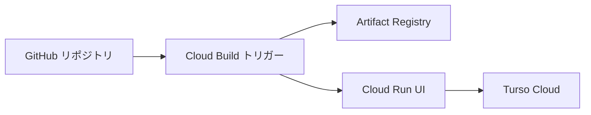

# Cloud Run 運用ガイド（Threadhall）

Next.js（[`output: "standalone"`](../../next.config.ts)）を **Dockerfile** でコンテナ化し、**Artifact Registry** に載せたうえで **Cloud Run** にデプロイします。DB は **Turso Cloud**（`TURSO_DATABASE_URL` / `TURSO_AUTH_TOKEN`）。

**デプロイ経路:** **Cloud Build**（リポジトリ接続・トリガー・手動実行は **GCP コンソール / `gcloud`**）。環境変数・シークレットの主管理は **Cloud Run の UI**（変数とシークレット）。本リポジトリには **GitHub Actions による Cloud Run デプロイ workflow は置かない**。

プロジェクト ID は **`threadhall-dev`**（検証）と **`threadhall-prod`**（本番）を想定。**GCP プロジェクトは分け、Turso も dev 用 DB / prod 用 DB を分ける**のが安全です。

**Turso Cloud の DB 名**も、プライマリなら例として **`threadhall-dev`** / **`threadhall-prod`** のように GCP プロジェクト ID と揃えることを推奨する（`TURSO_DATABASE_URL=libsql://threadhall-dev-…` のホストで判別しやすい）。作成後は環境ごとに **別の auth token** を発行し、dev のトークンを prod に入れない。

## どの Dockerfile をどこで使うか（決定事項）

| 対象 | Docker ファイル | 中身 |
|------|-----------------|------|
| **ローカル** `docker compose` | [Dockerfile.dev](../../Dockerfile.dev) | `next dev`、ホットリロード用ボリュームあり（[compose](../../docker-compose.yml)） |
| **GCP threadhall-dev**（Cloud Build / Cloud Run 検証） | [Dockerfile](../../Dockerfile) | [cloudbuild.dev.yaml](../../cloudbuild.dev.yaml)。`next build` の **standalone** + `node server.js`。イメージタグのみ `*-dev` で prod と区別 |
| **GCP threadhall-prod**（本番） | [Dockerfile](../../Dockerfile) | [cloudbuild.yaml](../../cloudbuild.yaml)。**standalone** + `node server.js`（コンテナでは `npm run start` でなく単体サーバのみを実行するのが推奨構成） |

**補足:** dev / prod で **起動方式は同一**。差分は GCP プロジェクト・Turso・Secret・Artifact Registry のタグだけ。

**Cloud Run と PORT:** standalone の `Dockerfile` は **`PORT` と `HOSTNAME=0.0.0.0`** で待受し、Cloud Run の注入 **`PORT`（例: 8080）** が Dockerfile 内の `ENV PORT=3000` を上書きする。**ローカルの `Dockerfile.dev` のみ** `npm run dev` が `PORT` に連動する。

## 全体像



1. **Cloud Build** が GitHub の push 等で起動し、[cloudbuild.yaml](../../cloudbuild.yaml) / [cloudbuild.dev.yaml](../../cloudbuild.dev.yaml) に従い **build → push → `gcloud run deploy`**（イメージ更新が中心）。
2. **機微な環境変数・Secret Manager 参照**は **Cloud Run コンソール**の「変数とシークレット」で維持（ビルドの deploy ステップで平文を増やしすぎない）。

---

## 各 GCP プロジェクトで共通してやること（dev / prod 両方）

`threadhall-dev` を先に完結させ、`gcloud config set project threadhall-prod` で同様に **prod** を用意します。

### 1. 必要 API の有効化

```bash
gcloud config set project threadhall-dev   # または threadhall-prod

gcloud services enable \
  run.googleapis.com \
  artifactregistry.googleapis.com \
  secretmanager.googleapis.com \
  cloudbuild.googleapis.com
```

### 2. Artifact Registry（Docker）

リージョン例: `asia-northeast1`（`_AR_HOSTNAME` は `asia-northeast1-docker.pkg.dev`）。

```bash
gcloud artifacts repositories create threadhall \
  --repository-format=docker \
  --location=asia-northeast1 \
  --description="Threadhall container images"
```

### 3. Secret Manager（推奨）

**dev / prod で名前は揃え、中身だけ変える**と運用しやすいです。

| Secret 名（例） | Cloud Run 環境変数名 | 内容 |
|------------------|---------------------|------|
| `better-auth-secret` | `BETTER_AUTH_SECRET` | `openssl rand -base64 32` など |
| `turso-auth-token` | `TURSO_AUTH_TOKEN` | Turso の DB トークン |
| `google-oauth-client-secret` | `GOOGLE_CLIENT_SECRET` | Google OAuth のシークレット |

Cloud Run サービス画面で **シークレットを環境変数としてバインド**。ランタイム用 SA に `roles/secretmanager.secretAccessor`。

### 4. Cloud Run（初回・UI）

1. Cloud Build で初回イメージが push 済みになるまで待つか、`gcloud builds submit` で一度回す。
2. **Cloud Run → 対象サービス → 編集 / 新しいリビジョンの構成** で **環境変数**（プレーン）を設定:
   - `NODE_ENV=production`
   - `TURSO_DATABASE_URL`（環境ごとに別）
   - `BETTER_AUTH_URL` = **`https://….run.app`**（末尾スラッシュなし）。**デプロイのたびに URL が変わる場合は都度更新**。
3. `GOOGLE_CLIENT_ID` 等、必要ならプレーンで追加。
4. Google Cloud Console の **OAuth クライアント** に、`BETTER_AUTH_URL` ベースのコールバック URL を登録。

### 5. 公開アクセス（Web なら）

「認証なしのアクセスを許可」または IAM で `allUsers` に `roles/run.invoker`。

### 6. DB マイグレーション

ローカルから対象 Turso へ:

```bash
export TURSO_DATABASE_URL=libsql://...
export TURSO_AUTH_TOKEN=...
npm run db:migrate
npm run db:status
```

`db:status` は適用済みマイグレと主要テーブル行数を表示する（読み取りのみ）。CLI が無い環境でも利用できる。

---

## Cloud Build：リポジトリ接続とトリガー（コンソール）

1. **Cloud Build → リポジトリ** で GitHub を[接続](https://cloud.google.com/build/docs/automating-builds/github/connect-repo-github)。
2. **トリガー**をプロジェクトごとに作成:
   - **threadhall-dev:** 構成ファイル **`cloudbuild.dev.yaml`**（ブランチ例: `develop`）。
   - **threadhall-prod:** **`cloudbuild.yaml`**（ブランチ例: `main`）。
3. **置換変数**に `_REGION`, `_AR_HOSTNAME`, `_AR_REPO`, `_SERVICE` を設定（[cloudbuild.yaml](../../cloudbuild.yaml) 冒頭の `substitutions` と一致させる）。

手動実行: コンソールの **トリガーを実行**、または Cloud Build の **「接続されたリポジトリからビルドを実行」** でブランチ・構成を指定。

### コマンドから試す

**本番（prod）:**

```bash
gcloud config set project threadhall-prod
gcloud builds submit --config cloudbuild.yaml \
  --substitutions=_REGION=asia-northeast1,_AR_HOSTNAME=asia-northeast1-docker.pkg.dev,_AR_REPO=threadhall,_SERVICE=threadhall-app
```

**開発 GCP（dev）:**

```bash
gcloud config set project threadhall-dev
gcloud builds submit --config cloudbuild.dev.yaml \
  --substitutions=_REGION=asia-northeast1,_AR_HOSTNAME=asia-northeast1-docker.pkg.dev,_AR_REPO=threadhall,_SERVICE=threadhall-app
```

### Cloud Build サービスアカウント

`<PROJECT_NUMBER>@cloudbuild.gserviceaccount.com` に、少なくとも Artifact Registry 書き込みと Cloud Run デプロイに必要なロールを付与。[公式: 権限](https://cloud.google.com/build/docs/securing-builds/configure-access-for-cloud-build-service-account)。

### `cloudbuild.yaml` の deploy ステップについて

`gcloud run deploy` は **主にイメージの差し替え**。**シークレット・本番 URL** は **Cloud Run UI** で管理すると、意図しない上書きを避けやすい。deploy に `--set-env-vars` を足す場合はチームで方針を決めてから [cloudbuild.yaml](../../cloudbuild.yaml) を編集。

---

## 環境変数一覧（再掲）

[.env.example](../../.env.example) を正とする。**Cloud Run では `BETTER_AUTH_URL` を必ず HTTPS のサービス URL に。** `THREADHALL_USE_EMULATE_GOOGLE` は本番で使わない。

---

## 関連ファイル

| ファイル | 役割 |
|----------|------|
| [Dockerfile](../../Dockerfile) | Cloud Run **dev / prod 共通**（standalone + `node server.js`） |
| [Dockerfile.dev](../../Dockerfile.dev) | **ローカル compose のみ**（`next dev`） |
| [cloudbuild.yaml](../../cloudbuild.yaml) | Cloud Build **prod** |
| [cloudbuild.dev.yaml](../../cloudbuild.dev.yaml) | Cloud Build **dev GCP**（同一 Dockerfile、`*-dev` タグ） |

---

## チェックリスト（threadhall-dev → threadhall-prod）

**インフラ共通**

- [ ] API 有効化（Run / AR / Secret Manager / Cloud Build）
- [ ] Artifact Registry（両プロジェクト）
- [ ] Secret Manager → Cloud Run にバインド
- [ ] Cloud Run サービス＋`BETTER_AUTH_URL`（dev / prod で別 URL）＋ Turso
- [ ] Turso: dev DB / prod DB 分離
- [ ] OAuth リダイレクト URI を環境ごとに登録
- [ ] `npm run db:migrate` を各 Turso に実行

**Cloud Build**

- [ ] GitHub リポジトリ接続（各 GCP プロジェクト）
- [ ] **dev:** `cloudbuild.dev.yaml` トリガー
- [ ] **prod:** `cloudbuild.yaml` トリガー
- [ ] 置換変数 `_REGION` などをトリガーに設定
- [ ] Cloud Build SA に AR + Run デプロイ権限

**その他**

- [ ] 公開範囲（未認証 invoker / IAP 等）
- [ ] 独自ドメイン利用時は `BETTER_AUTH_URL` をカスタム HTTPS に合わせる
