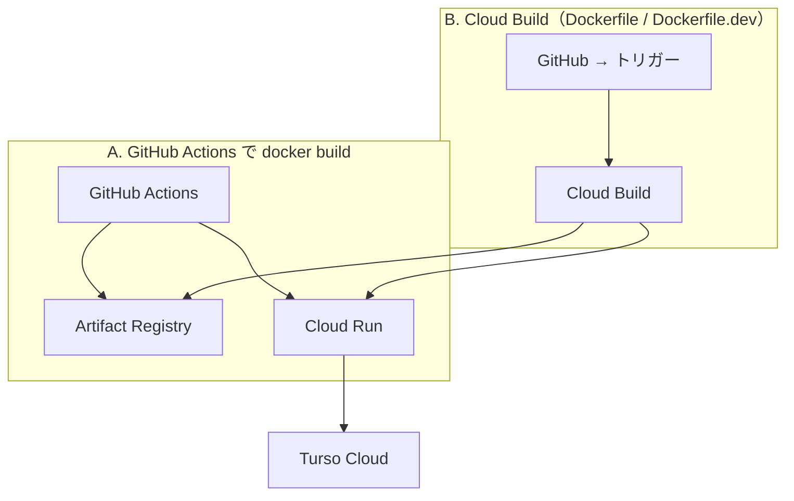

# Cloud Run 運用ガイド（Threadhall）

Next.js（[`output: "standalone"`](../../next.config.ts)）を **Dockerfile** でコンテナ化し、**Artifact Registry** に載せたうえで **Cloud Run** にデプロイします。DB は **Turso Cloud**（`TURSO_DATABASE_URL` / `TURSO_AUTH_TOKEN`）。

プロジェクト ID は **`threadhall-dev`**（検証）と **`threadhall-prod`**（本番）を想定しています。**GCP プロジェクトは分けるが、Turso は用途に応じて dev 用 DB / prod 用 DB を別インスタンスにする**のが安全です。

## どの Dockerfile をどこで使うか（決定事項）

| 対象 | Docker ファイル | 中身 |
|------|-----------------|------|
| **ローカル** `docker compose` | [Dockerfile.dev](../../Dockerfile.dev) | `next dev`、ホットリロード用ボリュームあり（[compose](../../docker-compose.yml)） |
| **GCP threadhall-dev**（Cloud Build / Cloud Run 検証） | **Dockerfile.dev** | 同上だがイメージ内のみ（`cloudbuild.dev.yaml`）。**ステージング向け**（本番相当の性能・セキュリティではない） |
| **GCP threadhall-prod**（本番） | [Dockerfile](../../Dockerfile) | `next build` の **standalone** + `node server.js`（[cloudbuild.yaml](../../cloudbuild.yaml) または GitHub Actions） |

**補足:** dev を長期ステージングとして運用し、本番に近い挙動が欲しい場合は、threadhall-dev でも **Dockerfile（prod）** を使う選択肢がある（Turso / OAuth だけ dev 用にする）。その場合は `cloudbuild.dev.yaml` の代わりに `cloudbuild.yaml` を dev プロジェクトで実行すればよい。

**Cloud Run と PORT:** `Dockerfile.dev` は **`PORT` 環境変数**で待受（未設定時 3000）。Cloud Run の既定 `8080` でそのまま動く。

## 全体像（CI の二通り）

どちらか一方でよいです。**ビルドを GCP に寄せたい**なら **B（Cloud Build）** が向きます。



| 方式 | メリット | 注意 |
|------|----------|------|
| **A. 現行 workflow**（[deploy-cloud-run.yml](../../.github/workflows/deploy-cloud-run.yml)） | 1 リポジトリですべて完結、GCP 上にビルド基盤を増やさない | GitHub のランナーで `docker build`（分単位の課金） |
| **B. Cloud Build**（[cloudbuild.yaml](../../cloudbuild.yaml)・[cloudbuild.dev.yaml](../../cloudbuild.dev.yaml)） | ビルドを GCP に寄せ、[GitHub と公式連携](https://cloud.google.com/build/docs/automating-builds/run-github-queries)しやすい | Cloud Build の課金・ビルド SA の IAM 設計が必要 |

**Cloud Run の待受ポート（本番 Dockerfile）:** ランタイムでは **`PORT`**（多く `8080`）です。本番 `Dockerfile` の `ENV PORT=3000` は **Cloud Run が上書き**します。`Dockerfile.dev` も `PORT` 参照に統一定義済み。

---

## 各 GCP プロジェクトで共通してやること（dev / prod 両方）

`threadhall-dev` を先に完結させ、同じ手順を **`gcloud config set project threadhall-prod`** で `threadhall-prod` に繰り返す想定です。

### 1. 必要 API の有効化

```bash
gcloud config set project threadhall-dev   # または threadhall-prod

gcloud services enable \
  run.googleapis.com \
  artifactregistry.googleapis.com \
  secretmanager.googleapis.com \
  iamcredentials.googleapis.com \
  cloudbuild.googleapis.com
```

GitHub Actions（OIDC）だけ使い Cloud Build を使わない場合でも、のちの拡張で Cloud Build を触るなら `cloudbuild.googleapis.com` を有効にしておくとよいです。

### 2. Artifact Registry（Docker）

リージョン例: `asia-northeast1`（`_AR_HOSTNAME` は `asia-northeast1-docker.pkg.dev`）。

```bash
gcloud artifacts repositories create threadhall \
  --repository-format=docker \
  --location=asia-northeast1 \
  --description="Threadhall container images"
```

### 3. Secret Manager（推奨）

**dev / prod で名前は揃え、中身だけ変える**と運用しやすいです。

| Secret 名（例） | Cloud Run 環境変数名 | 内容 |
|------------------|---------------------|------|
| `better-auth-secret` | `BETTER_AUTH_SECRET` | `openssl rand -base64 32` など |
| `turso-auth-token` | `TURSO_AUTH_TOKEN` | Turso の DB トークン |
| `google-oauth-client-secret` | `GOOGLE_CLIENT_SECRET` | 本番 Google OAuth のシークレット（Id は通常プレーン env で可） |

作成例:

```bash
echo -n "your-secret" | gcloud secrets create better-auth-secret --data-file=-
```

Cloud Run サービス画面で「変数とシークレット」から**シークレットを環境変数としてバインド**します。**ランタイム用サービスアカウント**（Cloud Run の「セキュリティ」で確認）に `roles/secretmanager.secretAccessor` が付いていることを確認してください。

**Turso の URL**（`libsql://...`）は機微ではない一方、**同一リポジトリの変数管理しやすさ**のため Secret に入れてもよいです。

### 4. Cloud Run（初回）

1. 一度イメージをデプロイできる状態にする（下記「初回デプロイ」参照）。
2. **環境変数**（プレーン）の例:
   - `NODE_ENV=production`
   - `TURSO_DATABASE_URL`（dev 用 / prod 用で値を分ける）
   - `BETTER_AUTH_URL` = その環境の **`https://xxxxx.a.run.app`（末尾スラッシュなし）**
3. `GOOGLE_CLIENT_ID` はプレーンで可。
4. OAuth のリダイレクト URI に、`BETTER_AUTH_URL` ベースのコールバック（Better Auth のパス）を **Google Cloud Console（OAuth クライアント）** に登録。

### 5. 公開アクセス（Web なら）

コンソールで「認証なしアクセスを許可」または IAM で `allUsers` に `roles/run.invoker`。**社内限定**なら Identity-Aware Proxy 等は別設計。

### 6. DB マイグレーション

ローカルから **該当プロジェクトの Turso** に向けて:

```bash
export TURSO_DATABASE_URL=libsql://...
export TURSO_AUTH_TOKEN=...
npm run db:migrate
```

本番は Cloud Run Job や手元の限定 CI から実行する運用を決めます。

---

## GitHub 連携（Workload Identity Federation）

**プロジェクトごと**に「GitHub のこのリポジトリから、この SA になりすましていい」と設定するのが分かりやすいです。

1. [キーなしで GitHub Actions を認証する](https://cloud.google.com/iam/docs/workload-identity-federation-with-deployment-pipelines)（Deployment pipelines / GitHub）
2. できあがる **Workload Identity プロバイダ** のフル名と、委譲先の **サービスアカウント メール** を GitHub の **Repository secrets** に保存:
   - `GCP_WORKLOAD_IDENTITY_PROVIDER`
   - `GCP_SERVICE_ACCOUNT`

**dev / prod を分ける典型:**

- GitHub **Environments** `development` / `production` を作り、環境ごとに上記 2 Secret と `GCP_PROJECT_ID` などの Variables を分ける。
- またはリポジトリ Secret を `GCP_WIF_PROVIDER_DEV` のように名前分けし、workflow で `github.ref` に応じて切り替える。

デプロイ SA に少なくとも付与:

- `roles/run.admin`（または運用ポリシーに合わせ `roles/run.developer` + 個別権限）
- `roles/artifactregistry.writer`
- Cloud Run の**実行サービスアカウントに対する** `roles/iam.serviceAccountUser`（`gcloud run deploy` が必要とする場合あり）

### 現行 GitHub Actions 用リポジトリ Variables

[deploy-cloud-run.yml](../../.github/workflows/deploy-cloud-run.yml) 用（環境ごとに値を変える）:

| Variable | dev 例 | prod 例 |
|----------|--------|---------|
| `GCP_PROJECT_ID` | `threadhall-dev` | `threadhall-prod` |
| `GCP_REGION` | `asia-northeast1` | 同左 |
| `GAR_REPOSITORY` | `threadhall` | 同左 |
| `CLOUD_RUN_SERVICE` | `threadhall-app`（例） | `threadhall-app`（同じ名前でも別プロジェクトなら可） |
| `CLOUD_RUN_DEPLOY_ENABLED` | `true` / 未設定 | main の auto deploy 用に `true` など |

---

## B. Cloud Build に任せる（Dockerfile ありき）

### B-1. 本番（threadhall-prod）— `Dockerfile` + [cloudbuild.yaml](../../cloudbuild.yaml)

**build → push → `gcloud run deploy`**。イメージ名は `$_SERVICE`（例: `threadhall-app`）。

```bash
gcloud config set project threadhall-prod
gcloud builds submit --config cloudbuild.yaml \
  --substitutions=_REGION=asia-northeast1,_AR_HOSTNAME=asia-northeast1-docker.pkg.dev,_AR_REPO=threadhall,_SERVICE=threadhall-app
```

### B-2. 開発 GCP（threadhall-dev）— `Dockerfile.dev` + [cloudbuild.dev.yaml](../../cloudbuild.dev.yaml)

dev 用イメージは **`$_SERVICE-dev`** サフィックス（例: `…/threadhall-app-dev:TAG`）で prod と区別。デプロイ先 Cloud Run サービス名は `_SERVICE`（例: `threadhall-app`）のまま **dev プロジェクト内**のサービスとする。

```bash
gcloud config set project threadhall-dev
gcloud builds submit --config cloudbuild.dev.yaml \
  --substitutions=_REGION=asia-northeast1,_AR_HOSTNAME=asia-northeast1-docker.pkg.dev,_AR_REPO=threadhall,_SERVICE=threadhall-app
```

### GitHub からトリガー（公式連携）

1. GCP コンソール **Cloud Build → リポジトリ** で GitHub を[接続](https://cloud.google.com/build/docs/automating-builds/github/connect-repo-github)。
2. **トリガーを 2 本**想定: **threadhall-dev** では **`cloudbuild.dev.yaml`**（ブランチ例: `develop`）、**threadhall-prod** では **`cloudbuild.yaml`**（ブランチ例: `main`）。
3. **置換変数** に `_REGION`, `_AR_HOSTNAME`, `_AR_REPO`, `_SERVICE` をトリガーごとに設定（両プロジェクトで同じ値でも可。イメージはプロジェクトで隔離される）。

### Cloud Build サービスアカウント（重要）

ビルドを実行する **`<PROJECT_NUMBER>@cloudbuild.gserviceaccount.com`** に、少なくとも:

- Artifact Registry への書き込み
- Cloud Run へのデプロイ（例: `roles/run.admin`）
- （イメージを別プロジェクトに push する場合はクロスプロジェクト権限）

を付与してください。公式: [Cloud Build サービスアカウントの権限](https://cloud.google.com/build/docs/securing-builds/configure-access-for-cloud-build-service-account)。

### 環境変数と `cloudbuild.yaml` の deploy

現在の `cloudbuild.yaml` の `gcloud run deploy` は **主にイメージ更新**です。`BETTER_AUTH_SECRET` などは **初回に Cloud Run コンソールで設定**し、以降は「デプロイで上書きされない」運用にすると安全です。デプロイ時に `--update-secrets` や `--set-env-vars` を足す場合は、チームで方針を決めてから `cloudbuild.yaml` に追記してください。

---

## A. 現行: GitHub Actions（docker build on runner）

- 手順の全体は上記と同じ（AR / Secret Manager / Cloud Run の初期設定）。
- [deploy-cloud-run.yml](../../.github/workflows/deploy-cloud-run.yml) は **`Dockerfile`（本番）だけ**をビルドする。**dev 用 `Dockerfile.dev` は使わない**（dev は B-2 や compose に任せる）。
- リポジトリに `GCP_WORKLOAD_IDENTITY_PROVIDER` と `GCP_SERVICE_ACCOUNT` を設定し、**GitHub Environment `production`** などで `GCP_PROJECT_ID=threadhall-prod` を渡す運用が安全。

ワークフロー内の `env_vars: NODE_ENV=production` は [deploy-cloudrun のマージ挙動](https://github.com/google-github-actions/deploy-cloudrun)により、コンソールで設定済みの変数と **マージ**される想定です（運用変更時は `env_vars_update_strategy` を確認）。

---

## 環境変数一覧（再掲）

[.env.example](../../.env.example) を正とします。**Cloud Run では `BETTER_AUTH_URL` を必ず HTTPS のサービス URLに。** `THREADHALL_USE_EMULATE_GOOGLE` は本番で使わない。

---

## 関連ファイル

| ファイル | 役割 |
|----------|------|
| [Dockerfile](../../Dockerfile) | **prod** multi-stage（standalone） |
| [Dockerfile.dev](../../Dockerfile.dev) | **ローカル compose + dev GCP**（`next dev`） |
| [cloudbuild.yaml](../../cloudbuild.yaml) | Cloud Build **prod**（`Dockerfile`） |
| [cloudbuild.dev.yaml](../../cloudbuild.dev.yaml) | Cloud Build **dev GCP**（`Dockerfile.dev`） |
| [.github/workflows/deploy-cloud-run.yml](../../.github/workflows/deploy-cloud-run.yml) | GitHub Actions: **`Dockerfile` のみ** |

---

## チェックリスト（threadhall-dev → threadhall-prod）

**インフラ共通**

- [ ] API 有効化（Run / AR / Secret Manager / IAMC / Cloud Build）
- [ ] Artifact Registry リポジトリ作成（両プロジェクト）
- [ ] Secret Manager（dev/prod で同名・別値推奨）→ Cloud Run にバインド
- [ ] Cloud Run サービス＋`BETTER_AUTH_URL`（**dev 用・prod 用で別 URL**）＋ Turso URL/トークン
- [ ] Turso: dev DB / prod DB を分離
- [ ] OAuth クライアント（Google）に **dev / prod それぞれの**リダイレクト URI
- [ ] `npm run db:migrate` を **各 Turso** に対して実行

**ビルド／デプロイ経路**

- [ ] **dev:** `cloudbuild.dev.yaml` + `Dockerfile.dev` のトリガー（`threadhall-dev`、ブランチ例 `develop`）
- [ ] **prod:** `cloudbuild.yaml` + `Dockerfile` のトリガー（`threadhall-prod`、ブランチ例 `main`）
- [ ] Cloud Build SA に AR 書き込み + Cloud Run デプロイ権限
- [ ] （任意）GitHub Actions 本番デプロイだけ使う場合は [deploy-cloud-run.yml](../../.github/workflows/deploy-cloud-run.yml) + WIF + **prod 専用** Environment

**その他**

- [ ] 公開 Web なら Run の未認証 invoker、内向きなら IAP 等の方針
- [ ] 本番の独自ドメインを使う場合: Cloud Run カスタムドメイン + **`BETTER_AUTH_URL` をその HTTPS に合わせて更新**
