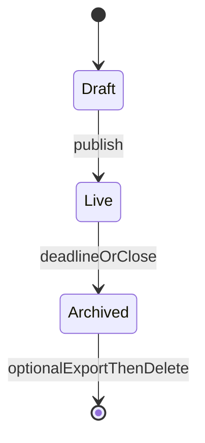
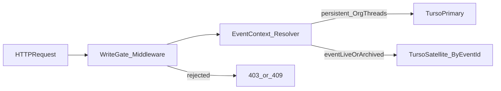

# データ設計とライフサイクル

## 二層データ面

| 層 | 保管対象 | Turso インスタンス |
|----|----------|-------------------|
| **プライマリ** | ユーザー／組織／メンバー／長命スレッド／イベントメタ／トークン発行記録など | **1 本（または論理で明確な少数）** |
| **サテライト** | イベント当日の高チャーン・高隔離データ（死因ログ等） | **イベントごとに 1 本** |

未決: プライマリが org ごとに分かれるかは [`open-questions-and-spikes.md`](open-questions-and-spikes.md) を参照。

長命スレッドをサテライトに閉じ込めない。**イベント終了後も日常会話はプライマリで継続**する。

## イベント状態遷移

- **Archived**: API で書込を拒否。DB トリガーは補助。オプションで CDN 向けスナップショット生成（[`open-questions-and-spikes.md`](open-questions-and-spikes.md)）。

## 書込ゲートの優先順位

| 優先 | レイヤ | 役割 |
|------|--------|------|
| 1 | 参加証明 | QR・短命 JWT・スタッフロール（**正**） |
| 2 | 地理・会場 | GeoIP・手動「会場モード」**補助** |
| 3 | 行タグ | `venue` / `region` / `event_id`（分析・表示整合） |

## リクエストルーティング（データ面・概念）

認証・認可の詳細は [`security-and-auth.md`](security-and-auth.md)。
