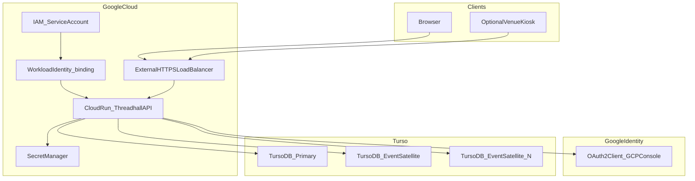
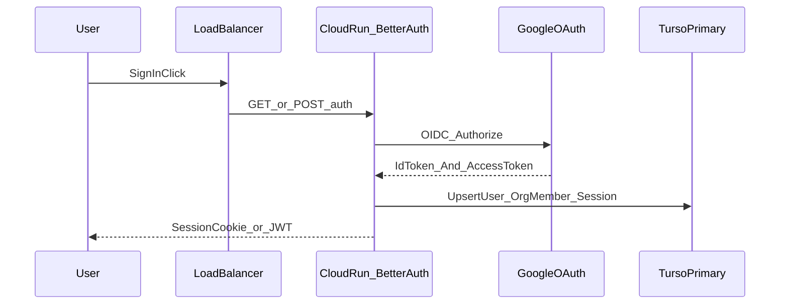
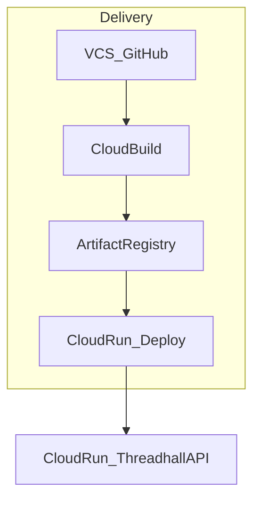

# システムアーキテクチャ（Google Cloud × Turso）

**推奨形**: 外向き HTTPS は **Global External Application Load Balancer**、アプリは **Cloud Run**、機密は **Secret Manager**。Google ログインは **GCP Console で作成した OAuth 2.0 クライアント** と Better Auth を接続。静的フロントは **Firebase Hosting** または **Cloud Storage + LB** でも同一論理構成に収まる（保管先は未決・[`open-questions-and-spikes.md`](open-questions-and-spikes.md)）。

## システム構成図（論理）

## 認証シーケンス（概念）

## 運用・CI/CD（概念）

## インフラメモ

- **Cloud Run**: 最小インスタンス 0 可。書込集中時は同時実行・CPU を調整。長時間 SSE は別検討
- **サテライト増殖**: プロビジョニング API は **IAM で実行主体を限定**（例: Cloud Run サービスアカウントのみ Turso 管理操作可）
